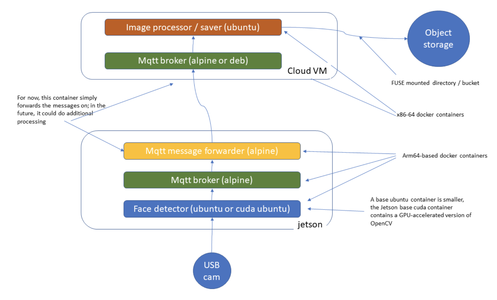

# HW3: Internet of Things

The task of this homework is to send pictures from the Jetson TX2 to an Object Store on IBM Cloud. The main technologies and software that were recommended and used in this project include a webcam, OpenCV, Docker, Alpine, Ubuntu, and Mosquitto. I followed the template below which is also found here: https://github.com/MIDS-scaling-up/v2/tree/master/week03/hw

<h4>The repo here for this task is organized by the platform it's run on: jetson or instance. All necessary files to run this are located in each folder and summarized below. </h4>

## 1. Jetson

On the Jetson side, there are three main parts:
1. Camera (run_camera.sh)
2. Broker (run_broker.sh)
3. Forwarder (run_forwarder.sh)

Each part has its own bash script to run that will trigger its respective Dockerfile, config files, and app components. This was done to make each part more unit testable. To get everything up and running, first use the `run_network.sh` script which sets up a user-defined bridge network for this respective section/platform. The main parts can be brought up in any order after that. I prefer to do forwarder, then broker, then camera.

Per the diagrams above, the pictures from the camera are captured by OpenCV which will then pass on the message to a Mosquitto broker. Note the message is in byte form for each of the transfers. The broker then passes the message to the forwarder which launches it to the instance for further processing. Line by line code details can be found via the comments of each file.

### Explanation of MQTT and Topic

The topic throughout this project is: face_cutter/camera-broker1. Only one topic was used since the data flows through only one pathway. The QoS that was used was 0 between the forwarder and the receiver below. This is because although higher QoS means more pictures are likeley to get through, it is also slower because of the extra steps in verification between the sender and the receiver. The pictures sent here are considered non-sensitive and we are able to capture many at a time. Therefore 0 was opted as the preferable option. **Note:** In each of the bash files, there are more explanations on the configs used for mosquitto.

## 2. Instance

On the Instance side, there are two main parts:
1. Receiver (run_receiver.sh)
2. Decoder (run_decoder.sh)

With a similar file structure and run steps as the Jetson side, a network is firstly set up. The other bash scripts can be run in any order. 

In terms of how it works, the receiver which is a mosquitto broker responsible for catching all the messages from the forwarder above is deployed. The decoder is registered to the receiver broker service and therefore will get the messages as well (don't need any special configurations for this from broker side). Once the decoder gets the messages, it takes the incoming message and transforms it back into an image and saves them to an Object Store Bucket on the IBM Cloud using the IBM SDK (https://ibm.github.io/ibm-cos-sdk-python/).

## Result

To view some of the pics taken, please go to http://tennisonyu-w251-hw3.s3.us-south.cloud-object-storage.appdomain.cloud/. You can append the above URL with whichever filename and extension.

For example:
http://tennisonyu-w251-hw3.s3.us-south.cloud-object-storage.appdomain.cloud/00027c6f-6e4e-483e-a8b2-ba10704c8e8e.png

## Interesting Considerations

__**Note 1**__

OpenCV and/or my camera do not seem to integrate all that well. Although extremely rare, note both of the below which seem to originate from imencode and libpng which is a dependency. Using the try-except method to continue the capture seems to have no detrimental effects so it is unclear what is causing these. 

Error 1:
cv2.error: /build/opencv-XDqSFW/opencv-3.2.0+dfsg/modules/imgcodecs/src/loadsave.cpp:798: error: (-215) code in function imencode

Error 2:
libpng warning: Image width is zero in IHDR
libpng warning: Image height is zero in IHDR
libpng error: Invalid IHDR data
OpenCV Error: Assertion failed (code) in imencode, file /build/opencv-XDqSFW/opencv-3.2.0+dfsg/modules/imgcodecs/src/loadsave.cpp, line 798

__**Note 2**__

For some strange reason, indenting got messed up in instance/app/index.py when committing changes. This should be resolved now in commit c7deba5d15efbe9a084a3d135170674742350f0c but it is unclear why this happened. Would need to address again if it happens. 

__**Note 3**__

For video capture function below, a try-except was used since it usually works with 1 but 0 worked instead for me. 

try:
    cap = cv2.VideoCapture(0)

except:
    cap = cv2.VideoCapture(1)
