# Homework 9: Distributed Training and Neural Machine Translation

In this homework, we train a Seq2Seq model which has been the source of many breakthroughs in machine translation. They are very expensive to train though and require huge amounts of data. Therefore, we will use a distributed training method to do it here with the guidance of instructions found here: https://github.com/MIDS-scaling-up/v2/tree/master/week09/hw.

## Setup

Two instances were brought up on IBM Cloud. Each instance contained 2 V100 GPUs and 2 TB of storage in addition to the 100 GB default. Per the instructions, necessary docker images, containers and data files were downloaded. The folder _docker_ contains the scripts to build the  container while the file `transformer-base.py` has the settings used for training. Noteworthy settings include a batch size of 256, 50000 steps, and the use of mixed precision.

To train, the following command was used:

`nohup mpirun --allow-run-as-root -n 4 -H <vm1 private ip address>:2,<vm2 private ip address>:2 -bind-to none -map-by slot --mca btl_tcp_if_include eth0 -x NCCL_SOCKET_IFNAME=eth0 -x NCCL_DEBUG=INFO -x LD_LIBRARY_PATH python run.py --config_file=/data/transformer-base.py --use_horovod=True --mode=train_eval &`

## Results and Questions

1. How long does it take to complete the training run? (hint: this session is on distributed training, so it will take a while)

To train 50 000 steps, it took approximately 22 hours.

2. Do you think your model is fully trained? How can you tell?

Per the training loss images, we can see that a saturation point has been reached. This is indicative that the model is trained.

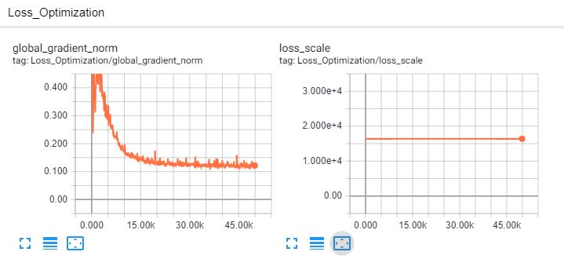

3. Were you overfitting?

It's unlikely we were overfitting. Per the evaluation loss below, there is no increase seen. Usually if there is overfitting this would occur because the model fits the training data so well but can't generalize to the evaluation data anymore. 

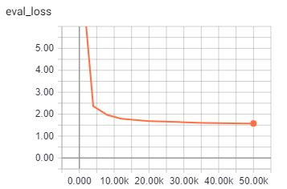

4. Were your GPUs fully utilized?

Yes, according to the below, all 4 GPUs seem to be fully used during the training process.

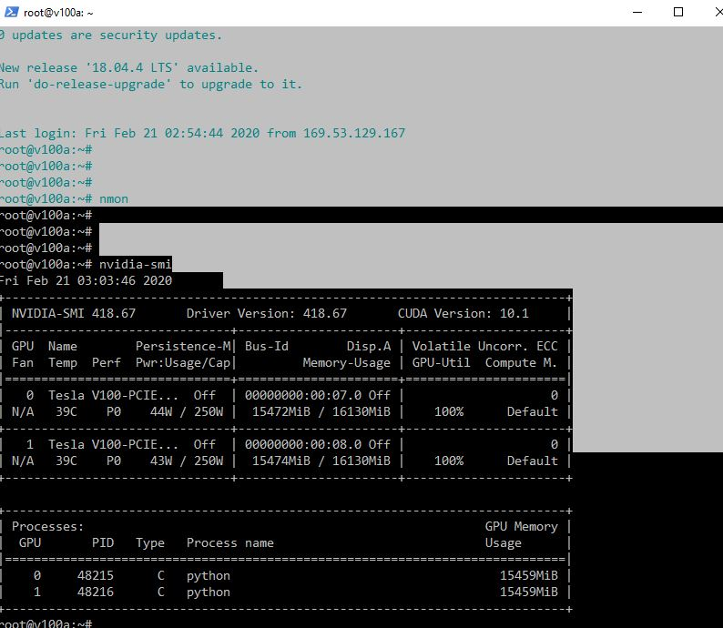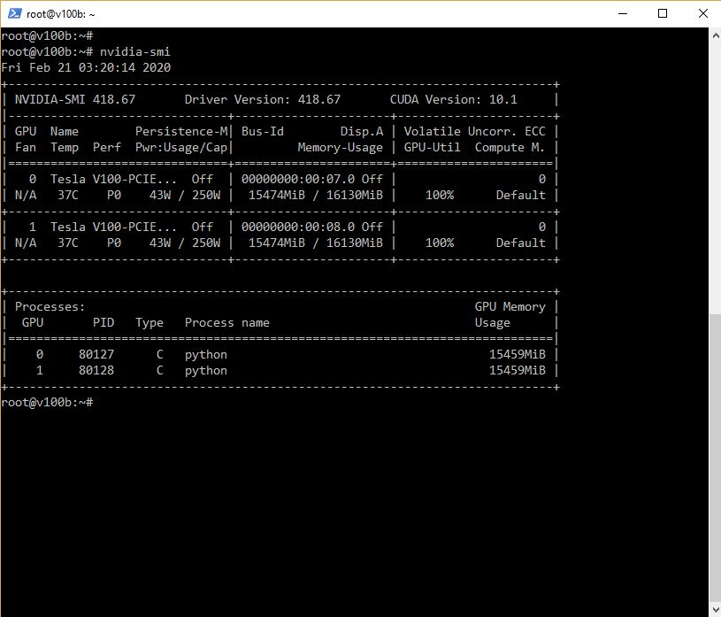

5. Did you monitor network traffic (hint: apt install nmon ) ? Was network the bottleneck?

Yes, the network traffic was monitored on both instances and the network was not a bottleneck for me in this case. As below, the instances were set to have a transfer rate of 1000Mbps. In the images below, we can see that network transfer rates were usually around 200-250Mbps. Therefore, data would have been flowing back and forth very freely. 

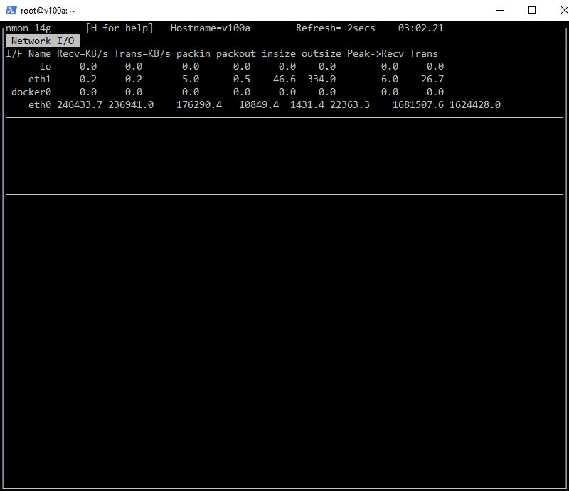
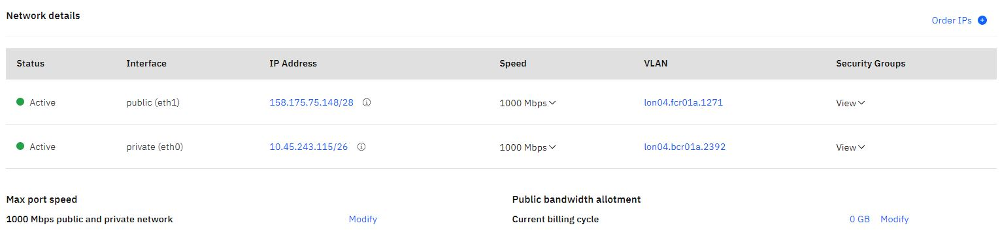

6. Take a look at the plot of the learning rate and then check the config file. Can you explan this setting?

From the below, it appears that the learning rate increases linearly at the beginning and then decreases slowly afterwards. This method appears to be partially based on https://arxiv.org/pdf/1706.03762.pdf, the famous `Attention is All you Need` paper. Here they specified they ramped up the learning rate for the first 4000 (8000 in our case) warmup_steps training steps, then decreased it proportionally to the inverse square root of the step number. In a way, treating the learning rate as an adaptable hyperparameter like this is smart because, one would expect the model to be terrible at first so it would be beneficial to zig-zag across the feature space as much as possible towards a minima. As the training proceeds and more data is observed, we want to calm the algorithm and allow it to make better decisions in the feature space as forward and back propagates. Note that there are also other concepts like momentum which help in picking ideal directions in the feature space to converge on. 

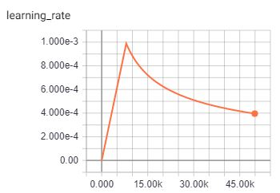

7. How big was your training set (mb)? How many training lines did it contain?

As below, the deutch dataset is about 710MB whereas the english one is 636MB. Both datasets have 4562102 lines.  

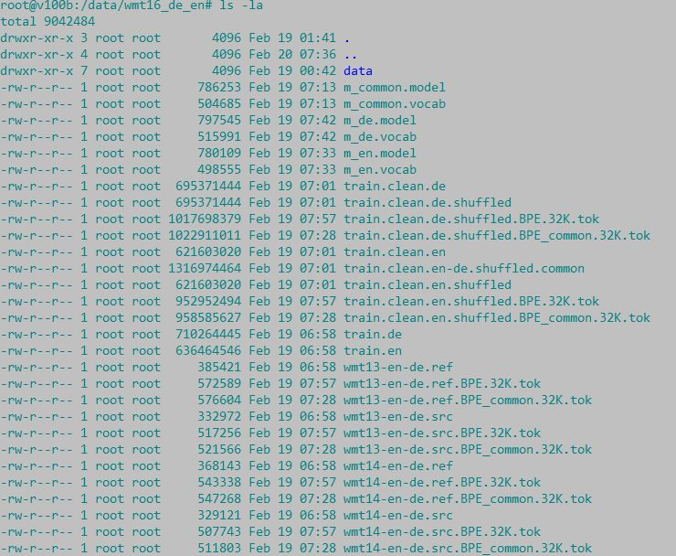
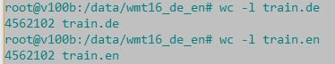

8. What are the files that a TF checkpoint is comprised of?

There are several files but the main ones seem to be data, index, and metadata files. There are also losses at different checkpoints, the model, etc. In more detail: the meta file describes the saved graph structure, the index file is an immutable table where each key is a name of a tensor and its value describes the metadata of a tensor, and lastly the datafile contains the tensor and values. 

9. How big is your resulting model checkpoint (mb)?

The model file which again includes data (852267044 b), index (36131 b), and metadata (16360030 b) sums up to be about 868 MB. In the checkpoint folder, there are 5 of these so it is about 4340 MB.

10. Remember the definition of a "step". How long did an average step take?

Step is essentially one gradient update. It's one iteration of a batch being processed. We did 50000 steps in ~22 hours meaning 0.631 steps/second.

11. How does that correlate with the observed network utilization between nodes?

Network should be inversely related to step. The better the network, the more steps that should be able to be processed per unit time. 

## Other observations

1. BLEU Evaluation Score

It is interesting to note that our BLEU evaluation score did not match exactly with the instructions though we arrive at approximately the same flattening point. With confirmation, it seems that the graphs found in the link instructions were ran on a P100 instead of a V100 and it has been noted before that using different GPUs can lead to different results (https://determined.ai/blog/reproducibility-in-ml/ , https://www.twosigma.com/insights/article/a-workaround-for-non-determinism-in-tensorflow/). The cause in this case could be related to how the two different GPU ingest batches at the start of training. It's noticeable that after the first point, the trend seems to be in line with the instructions.

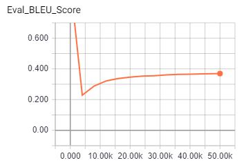

2. Limiting the Network Bandwidth

Limiting the network bandwidth to 10Mbps, we saw changes in the performance of the GPUs where the performance would dip on ocassion from 100% to 70-80%. This is in line with what was discussed previously.

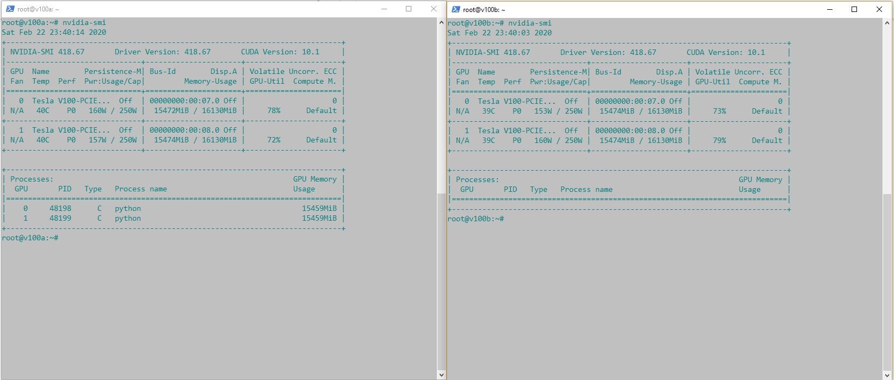

## Conclusion

Given our results, we seem to have adequate training. The flattening out portions seem to match those seen in the examples. Therefore the model for en-de translation seems to be a good one.
