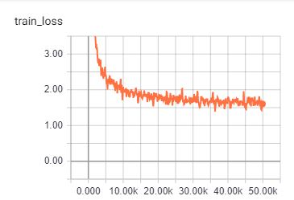

# Homework 9: Distributed Training and Neural Machine Translation

In this homework, we train a Seq2Seq model which has been the source of many breakthroughs in machine translation. They are very expensive to train though and require huge amounts of data. Therefore, we will use leverage a distributed training method to do it here with the guidance of instructions found here: https://github.com/MIDS-scaling-up/v2/tree/master/week09/hw.

## Setup

Two instances were brought up on IBM Cloud. Each instance contained 2 V100 GPUs and 2 TB of storage in addition to the 100 GB default. Per the instructions, necessary docker images, containers and data files were downloaded. The folder _docker_ contains the scripts to build the  container while the file `transformer-base.py` has the settings used for training. Noteworthy settings include a batch size of 256, 50000 steps, and the use of mixed precision.

To train, the following command was used:

`nohup mpirun --allow-run-as-root -n 4 -H <vm1 private ip address>:2,<vm2 private ip address>:2 -bind-to none -map-by slot --mca btl_tcp_if_include eth0 -x NCCL_SOCKET_IFNAME=eth0 -x NCCL_DEBUG=INFO -x LD_LIBRARY_PATH python run.py --config_file=/data/transformer-base.py --use_horovod=True --mode=train_eval &`

## Results and Questions

1. How long does it take to complete the training run? (hint: this session is on distributed training, so it will take a while)

To train 50 000 steps, it took approximately 22 hours.

2. Do you think your model is fully trained? How can you tell?

3. Were you overfitting?
4. Were your GPUs fully utilized?
5. Did you monitor network traffic (hint: apt install nmon ) ? Was network the bottleneck?
6. Take a look at the plot of the learning rate and then check the config file. Can you explan this setting?
7. How big was your training set (mb)? How many training lines did it contain?
8. What are the files that a TF checkpoint is comprised of?
9. How big is your resulting model checkpoint (mb)?
10. Remember the definition of a "step". How long did an average step take?
11. How does that correlate with the observed network utilization between nodes?
